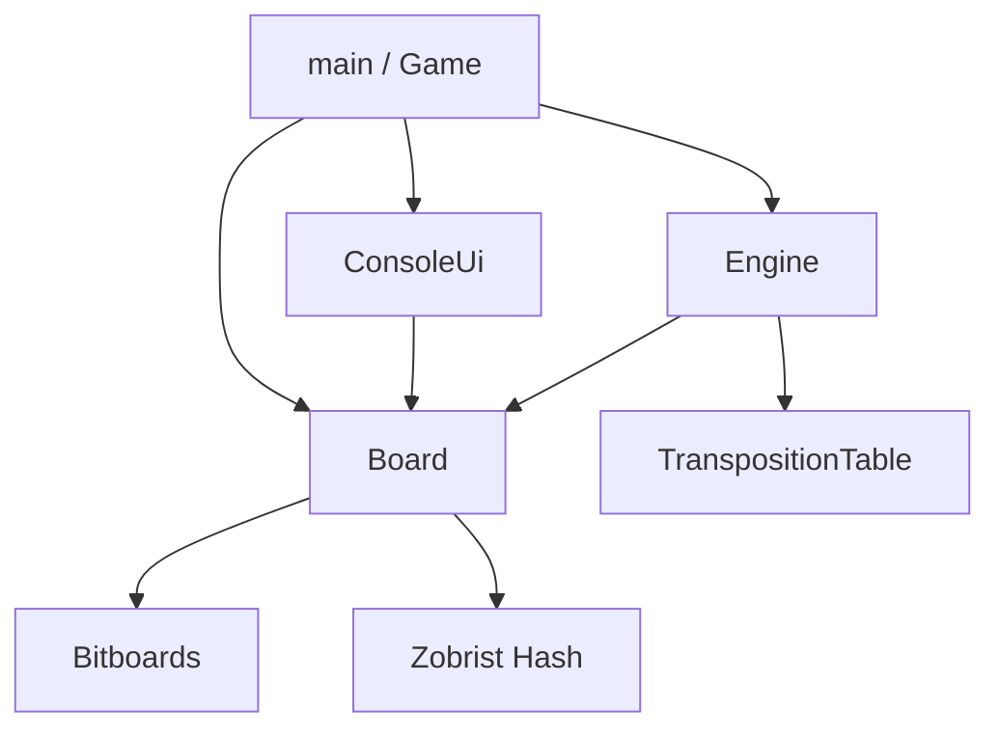

# Implementation Details

This document describes the current implementation of `othello-on-the-fly`.

## Overview

The project has three main parts:

- **Board**: game state, move generation, move application, undo, and hashing
- **Engine**: alpha-beta search, iterative deepening, transposition table, and search stats
- **Game/UI**: console rendering, input parsing, and game modes

The board and engine code do not depend on terminal input/output.

## Architecture Diagram

## Board

The `Board` class stores the position using two 64-bit bitboards:

- one bitboard for black discs
- one bitboard for white discs

It also stores the current player.

Main responsibilities:

- read and write squares
- check legal moves
- generate moves for the current player
- apply and undo moves
- evaluate the board by disc count
- compute a Zobrist hash for the position

Moves use the `Move` struct:

- `row` and `col` identify the destination square
- `flipped_discs` stores which discs are flipped

The engine uses `flipped_discs` to search with make/undo instead of copying the board at every node.

## Engine

The engine uses alpha-beta pruning to search for the best move.

Current features:

- pass-turn handling
- iterative deepening
- time and node budgets
- search statistics
- transposition-table lookups
- move ordering heuristics

The main public APIs are:

- `alphabeta(...)`
- `find_best_move(board, depth)`
- `find_best_move(board, SearchOptions)`

`SearchOptions` supports:

- maximum depth
- optional time limit
- optional node limit
- transposition-table size
- iterative deepening on/off

`SearchResult` returns:

- best move
- score
- search stats
- whether the requested search finished

### Move Ordering

Moves are ordered using:

1. transposition-table move
2. corner priority
3. killer moves
4. edge preference
5. history heuristic
6. a penalty for X-squares near corners

### Evaluation

The current evaluation is simple:

- disc difference from the perspective player

This keeps the engine easy to understand, but it is still weaker than a more advanced evaluation.

## Transposition Table

The transposition table is a fixed-size slot table.

It stores:

- position hash
- score
- search depth
- bound type
- a lightweight best move

Current behavior:

- direct slot lookup by hash
- deeper entries replace shallower ones for the same hash
- older generations can be replaced in later searches

The default size is `1 << 20` slots.

## Game And Console UI

The game layer runs the three modes:

- **PvP**
- **PvE**
- **Autoplay**

The console UI is separate from the board logic. It handles:

- rendering the board
- rendering scores and valid moves
- parsing commands
- prompting for moves

Supported commands include:

- `help`
- `board`
- `moves`
- `score`
- `quit`

The rendered board can also show valid-move hints.

## Build And Tools

The project uses CMake.

Current build targets include:

- `board`
- `engine`
- `game`
- `othello`
- `search_benchmark`

### Tests

There are test suites for:

- board state
- move logic
- engine and transposition table behavior
- console UI rendering and parsing

### Coverage

Coverage is generated by `scripts/coverage.sh`.

It:

- creates a coverage build
- runs the tests
- merges profiling data
- generates an HTML report with `llvm-cov` and `llvm-profdata`

### Benchmarking

The `search_benchmark` executable measures engine performance.

It supports:

- opening, midgame, and endgame scenarios
- depth selection
- repeat count
- node limit
- time limit

The current local benchmark snapshot is recorded in `docs/mynotes/current_benchmark_snapshot.md`.

## Current Status

What is already in good shape:

- board logic is separated from UI
- the engine has iterative deepening and TT reuse
- search uses make/undo instead of copying the board at each node
- the CLI is testable and easier to use

What is still intentionally simple:

- evaluation is basic
- search is single-threaded
- there is no graphical UI
- advanced pruning and stronger heuristics are future work
